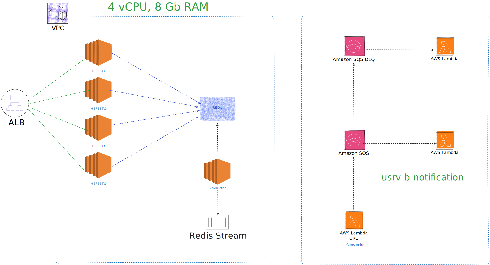

Instalaciones necesarias

instalar nodeJs

instalar artillery:
https://www.artillery.io/

instalar docker

ejecutar el siguiente comando para cada cambio que se realiza en el código: 
./gradlew clean && ./gradlew build && ./gradlew jar

Diagrama V4:
